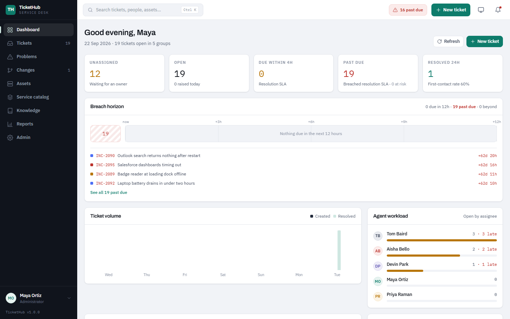
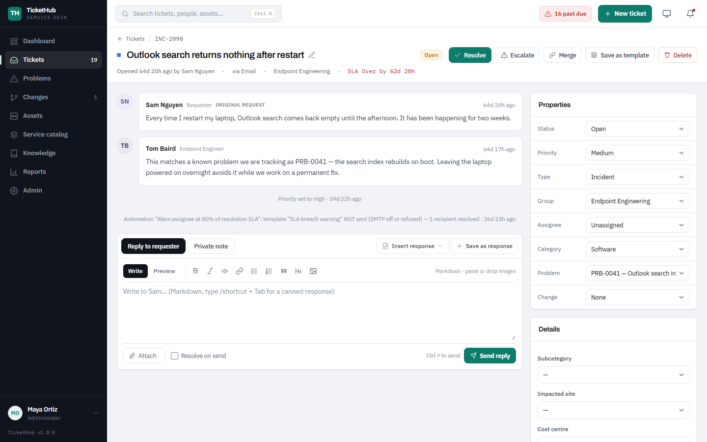
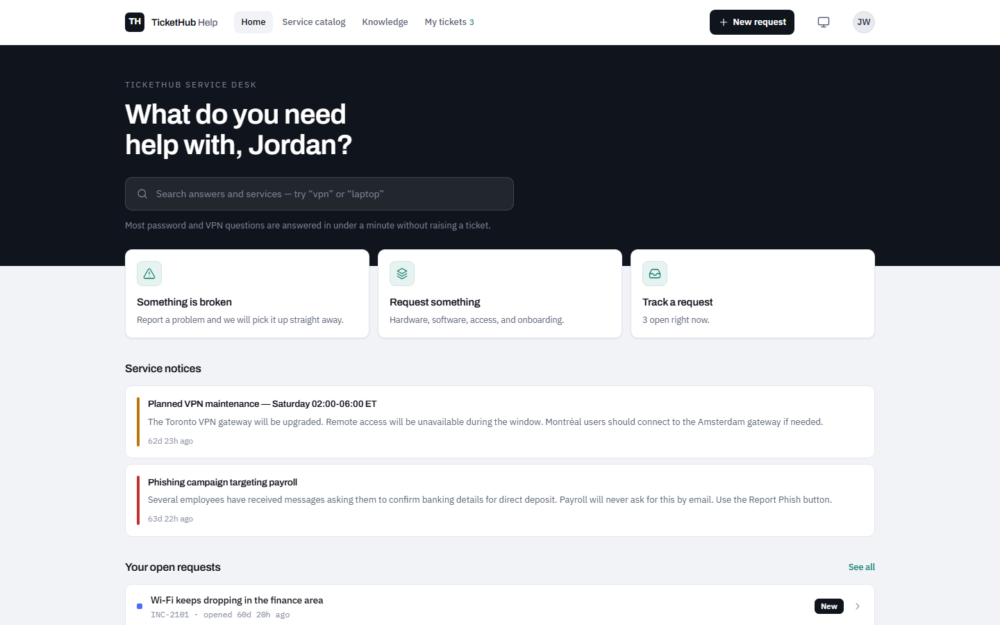
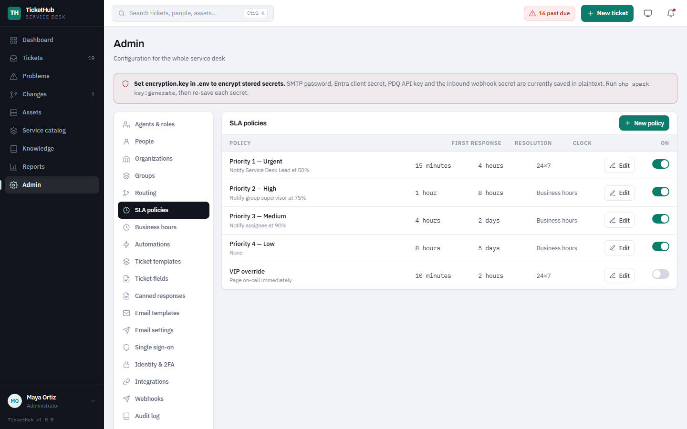

# TicketHub

[](https://github.com/<org>/tickethub/actions/workflows/ci.yml)
[](LICENSE)
[](composer.json)
[](https://codeigniter.com)

TicketHub is a self-hosted IT service desk for teams that want ITSM without
the enterprise price tag: tickets with real SLAs and business hours, problems,
changes and assets, a self-service portal with a knowledge base and service
catalog, automations, email in and out, single sign-on, two-factor
authentication, webhooks and a JSON API — in **one CodeIgniter 4 application
on MySQL/MariaDB**. No JavaScript build step, no queue workers, no Composer at
runtime. Clone it, point a web server at `public/`, run two `spark` commands.

## Screenshots

<!-- Screenshots live in docs/screenshots/ (see docs/screenshots/README.md). -->

| Agent workspace | Ticket view |
| --- | --- |
|  |  |

| Self-service portal | Admin — SLA and business hours |
| --- | --- |
|  |  |

## Features

- **Tickets** — incidents and service requests, priorities, categories, tags,
  tasks, watchers, linked tickets, merges, bulk actions, saved views, time
  tracking, custom fields, CSV export, full audit trail.
- **SLA with business hours** — per-priority response and resolution targets,
  calendars with holidays, pause while *Pending*, warnings before breach.
- **Routing and teams** — groups, routing rules, default team, claim/escalate,
  approvals for service requests.
- **Problems, changes, assets** — root-cause records, change requests with
  risk/window/approvals, an asset inventory with PDQ Connect import.
- **Service catalog and knowledge base** — catalog items with dynamic forms,
  articles with votes and suggestions while a requester types.
- **Automations** — event- and time-based rules: auto-close, nudges,
  escalation, notifications.
- **Email** — SMTP notifications with editable templates, Microsoft 365
  mailbox polling (Graph), a generic inbound webhook, threading, daily digest.
- **Portal** — raise and follow tickets, reply, rate, browse KB and catalog,
  announcements.
- **Identity** — local accounts with strong-password rules, Microsoft Entra ID,
  generic OIDC, LDAP/Active Directory, TOTP two-factor with recovery codes.
- **Integration** — bearer-token JSON API scoped to a user, signed outbound
  webhooks with retries, organizations for multi-tenant scoping.
- **Agent comfort** — canned responses, Markdown, ticket templates and
  recurring tickets, notification centre, dark mode, translatable UI.
- **Operations** — data retention, `tickethub:setup`, production `.env`
  template, Docker image and Compose stack, CI, PHPUnit feature suite.

## Quick start with Docker

```bash
cp docker/.env.docker.example .env.docker      # edit the passwords
docker compose up -d --build                   # app on http://localhost:8080
docker compose exec app php spark tickethub:setup --email you@company.com --name "Your Name"
```

The first command configures the stack, the second builds the image, starts
MariaDB, runs the migrations and the scheduler, and the third prints a
one-time password for the first Administrator. Sign in at
http://localhost:8080/login and choose your own.

What is running: `app` (Apache + PHP 8.2, `public/` as document root), `db`
(MariaDB 11 on a named volume) and `cron` (the same image looping over the
[scheduled commands](#cron-jobs)). Attachments, sessions and logs live on the
`app_writable` volume. `docker/entrypoint.sh` writes the application `.env`
from the `.env.docker` values on first boot; mount your own `.env` into the
container to take over. Set `APP_BASE_URL` to your public `https://` URL and
put a TLS-terminating proxy in front before exposing it.

## Manual install

Requirements: PHP 8.2+ with `intl`, `mbstring`, `mysqli`, `curl`, `openssl`,
`json` (plus `gd` for image thumbnails and `ldap` for directory sign-in);
MySQL 8.0+ or MariaDB 10.6+; Apache with `mod_rewrite`, nginx or Caddy with
the document root at `public/`; cron. Composer is only needed for the test
suite — the framework lives in `system/`.

```bash
git clone https://github.com/<org>/tickethub.git tickethub && cd tickethub
cp env.production.example .env      # then edit: baseURL, database.default.*
php spark key:generate              # writes encryption.key into .env
php spark migrate --all             # creates the schema (no demo data)
php spark tickethub:setup --email you@company.com --name "Your Name"
```

`tickethub:setup` creates the first Administrator and prints a one-time
password; you choose your own at first sign-in. It refuses to run when an
Administrator already exists unless you pass `--force`.

For a local demo, keep `CI_ENVIRONMENT = development` (copy `env` instead of
the production template) and run `php spark db:seed TicketHubSeeder` — this
loads fictional teams, people and tickets. Every seeded account signs in with
the password `password` and is forced to change it. The seeder refuses to run
in production unless `TICKETHUB_ALLOW_DEMO_SEED=1` is set. To try it without
a web server: `php spark serve` and open http://localhost:8080.

## Production checklist

Copy `env.production.example` to `.env` and fill in the values. In short:

1. **`CI_ENVIRONMENT = production`** — turns off the debug toolbar and
   detailed error pages, enables HTTPS-only + HSTS, marks cookies `Secure`,
   hides the demo-login block, and blocks the demo seeder.
2. **`app.baseURL`** — the public `https://` URL, with a trailing slash.
3. **`encryption.key`** — run `php spark key:generate`. Without it, SMTP /
   Entra / PDQ / webhook secrets are stored in plaintext and the Admin page
   shows a warning.
4. **Database** — `database.default.*` in `.env`; the DB user needs DDL rights
   for migrations.
5. **Web server document root = `public/`**. Never expose the project root.
   `public/.htaccess` handles rewrites on Apache; for nginx use
   `try_files $uri $uri/ /index.php?$args;`.
6. **`writable/` must be writable** by the PHP user (sessions, cache, logs,
   uploaded attachments live there):
   `chown -R www-data:www-data writable && chmod -R ug+rwX writable`.
7. **Cron** — see [Cron jobs](#cron-jobs). Every 5 minutes is plenty for the
   ticket scheduler.
8. **First admin** — `php spark tickethub:setup --email ...` (see Install).
9. **Email** — Admin → Email settings (SMTP host, port, credentials, from
   address). Needed for invites, password resets and notifications. Send a
   test from the same page.
10. **Microsoft 365 mailbox → tickets** (optional) — Admin → Email settings →
    "Microsoft 365 mailbox": uses the Entra app registration below with the
    application permission `Mail.ReadWrite`. Polled by the cron job.
11. **Single sign-on** (optional) — Admin → Single sign-on. Register a Web app
    in Entra ID with redirect URI `https://<host>/auth/azure/callback`, paste
    tenant id (a GUID; `common`/`organizations` are accepted but let any work
    account sign in), client id and client secret. For automatic role
    mapping, add the **groups claim** to the ID token in the app's *Token
    configuration* and paste the object ids of your agent and administrator
    groups.
12. **Inbound email webhook** (optional) — Admin → Email settings → Inbound.
    Your mail provider POSTs to `/api/inbound-email` with the
    `X-Inbound-Secret` header shown there.
13. **Backups** — the MySQL database plus `writable/uploads/`.

Sessions expire after 8 hours of inactivity. Changing or resetting a password
signs out every other browser for that account.

## Configuration

Everything an administrator changes lives in the Admin area (`/app/admin`) and
is stored in the database; secrets are encrypted at rest when `encryption.key`
is set. Environment-level settings (URL, database, environment) live in
`.env` — see `env.production.example` for every supported key.

### SMTP and notifications

Admin → **Email settings**: host, port, encryption, credentials, from
address, and a test-send button. Notification templates (new ticket, reply,
status change, SLA warning, …) are editable under Admin → **Templates**, and
each user can tune what they receive under their account preferences. When
SMTP is not configured, mail is skipped and logged rather than failing.

### Inbound email

Two ways to turn mail into tickets and replies:

- **Microsoft 365 mailbox** — Admin → Email settings → *Microsoft 365
  mailbox*. Uses the Entra app registration with application permission
  `Mail.ReadWrite`; `tickets:cron` polls it. Replies are threaded by
  message id; a reply to a closed ticket reopens it within the configurable
  window or creates a new one.
- **Generic webhook** — any provider that can POST parsed mail to
  `/api/inbound-email` with the `X-Inbound-Secret` header. Unknown senders
  are handled by the policy you pick (create requester / reject).

### SSO / OIDC / LDAP and 2FA

<!-- SECTION: identity -->
**Two-factor authentication.** Any user can enrol an authenticator app (Google or Microsoft Authenticator, Authy, 1Password) at Account → Security: scan the QR code, confirm a code, and save the ten one-time recovery codes. Admin → Identity & 2FA sets the policy (optional, required for agents, or required for everyone); users in scope are held on the Security page until enrolled. Administrators can reset a user's 2FA there. Secrets are encrypted at rest when `encryption.key` is set.

**Single sign-on (Microsoft Entra ID).** Admin → Single sign-on: tenant, client ID and secret; redirect URI `<base>/auth/azure/callback`. Optional Entra group IDs map members to Agent or Administrator.

**Single sign-on (OpenID Connect / Google).** Admin → Identity & 2FA → OpenID Connect: click *Google Workspace* (issuer `https://accounts.google.com`) or enter any issuer with a discovery document (Okta, Keycloak, Auth0, Authentik); add redirect URI `<base>/auth/oidc/callback` at the provider; paste client ID and secret. Existing accounts match by email; new people are created as Requesters. Optional role mapping: claim and value for Agent and Administrator (for example `groups` contains `it-admins`). Supervisors and the last Administrator are never demoted.

**LDAP / Active Directory.** Requires the php-ldap extension. Configure host, port, encryption, a read-only bind account, base DN and user filter (`{login}` is what was typed). On sign-in, unknown emails and directory-linked accounts are verified against the directory, profile attributes are synced, and `memberOf` can map roles. Local accounts keep local passwords; 2FA still applies.

**Notification preferences.** Account → Notifications: per-event email and in-app checkboxes, plus "Daily digest instead of instant email". The digest is sent by `php spark tickethub:digest` (schedule daily; `--dry-run` previews).
<!-- /SECTION: identity -->

### Replies, Markdown and templates

<!-- SECTION: replies -->
**Canned responses.** Admin → Canned responses holds global and per-group responses with an optional `/shortcut`. Agents insert them from the reply box ("Insert response", searchable) or by typing `/shortcut` at the start of a line and pressing Tab. Placeholders `{{requester_first_name}}`, `{{requester_name}}`, `{{agent_name}}`, `{{ticket_code}}` and `{{ticket_subject}}` are filled in. "Save as response" keeps a personal one.

**Markdown replies.** Agent and portal reply boxes accept Markdown (headings, bold, italic, code, links, lists, quotes) with a toolbar and a Preview tab. Paste or drop an image to attach it inline. Older messages render unchanged. Email copies of Markdown replies are sent as HTML with a plain-text alternative.

**Ticket templates and recurring tickets.** Admin → Ticket templates defines pre-filled tickets with a task list. "Start from template" sits at the top of New ticket, and supervisors can save any ticket as a template. A recurring schedule (daily, weekly or monthly, in a chosen timezone) raises a ticket from a template; this needs `php spark tickets:cron`.

**CSAT by email.** The resolution email includes five one-tap rating links that need no sign-in. Ratings are single-use, and a comment can be added once within 7 days.

**Reply by email (agents).** An agent answering a ticket notification from their mail client posts a public reply with quoted history stripped. Start the message with `#note` to file it as a private note instead.
<!-- /SECTION: replies -->

### Webhooks, organizations and the API

<!-- SECTION: platform -->
**Organizations.** Admin → Organizations: name, email domain, notes. "Auto-assign by email domain" attaches every person with a matching email who has no organization yet. The People dialog has an Organization select, and the ticket list can filter by organization.

**Webhooks.** Admin → Webhooks: URL, signing secret (shown once) and an event list. Payload is JSON `{event, occurred_at, data}` with headers `X-TicketHub-Event`, `X-TicketHub-Delivery` and `X-TicketHub-Signature: sha256=HMAC-SHA256(secret, raw body)`. Deliveries time out after 5 seconds and retry at 1m, 5m, 30m, 2h and 12h via `php spark tickethub:webhooks`; an endpoint is disabled after 20 consecutive failures. The delivery log has Retry and Send test.

**REST API.** Bearer tokens from Admin → Integrations act as a chosen user, can expire, and are rate limited to 120 requests per minute. Resources: `me`, `tickets` (list, create, show, PATCH, reply, messages), `users`, `organizations`, `kb/articles`, `assets`, `changes` (with approve and reject), `problems`. Lists return `{data, page, per_page, total}`; errors return `{error}`. Interactive docs at `/api/docs`, the OpenAPI 3 spec at `/api/openapi.json`, and curl examples in [docs/api/README.md](docs/api/README.md).

**Data lifecycle.** People → Edit → "Export data (JSON)" or "Anonymize". Admin → Data retention sets how long Closed tickets, audit rows, webhook deliveries and read notifications are kept (0 keeps forever), whether attachments are purged with tickets, and previews the counts. `php spark tickethub:retention` applies it (daily; `--dry-run` previews). Orphaned uploads older than 7 days are always swept.
<!-- /SECTION: platform -->

The core of the API, for reference. Create a token under Admin →
**Integrations → API tokens**. Each token acts as one chosen
agent/supervisor/administrator (their role and team scope apply, and the
audit log names them), can be given an expiry in days, and is limited to
120 requests per minute. Tokens are shown once and stored hashed.

```
Authorization: Bearer <token>
Content-Type: application/json

GET  /api/tickets?status=Open&open=1&page=1&per_page=25
GET  /api/tickets/INC-2101
POST /api/tickets          {"subject": "...", "body": "...", "requester_id": 7,
                            "priority": "High", "type": "Incident",
                            "category": "Network", "group_id": 2}
POST /api/tickets/INC-2101/reply   {"body": "...", "kind": "reply" | "note"}
```

Responses are JSON. Errors are `{"error": "..."}` with 400 (bad JSON),
401/403 (auth), 404, 422 (validation) or 429 (rate limit). API calls never
receive a session cookie.

### Appearance and languages

<!-- SECTION: ux -->
**Dark mode.** TicketHub follows your operating system's colour scheme automatically. Use the sun/moon button in the header (or Appearance in the account menu) to force Light or Dark; the choice is remembered per browser. Native controls, error pages and the SLA burn bar all follow the theme.

**Languages.** The interface ships in English and French. Switch with the EN/FR links in the portal footer or the account menu; an administrator sets the site default under Admin → General → Default language, and first-time visitors get their browser's language. Adding a language is a copy of `app/Language/en/`; see [docs/i18n.md](docs/i18n.md).
<!-- /SECTION: ux -->

## Cron jobs

TicketHub has no queue workers; a handful of `spark` commands do the
background work. With Docker the `cron` service runs them for you
(`docker/cron.sh`). On a manual install add them to crontab (or the Windows
Task Scheduler) for the PHP user:

| Command | Schedule | What it does |
| --- | --- | --- |
| `php spark tickets:cron` | every 5 minutes | SLA warnings and breaches, time-based automations (auto-close, nudges, escalation), Microsoft 365 mailbox poll, PDQ auto-sync. Takes a lock, so overlapping runs are harmless. |
| `php spark tickethub:webhooks` | every 5 minutes | Retries failed outbound webhook deliveries that are due. |
| `php spark tickethub:digest` | daily (e.g. 07:00) | Emails each user who opted in a summary of their open work. |
| `php spark tickethub:retention` | daily (off-hours) | Purges closed tickets, audit rows and webhook deliveries older than the retention settings. |

```cron
*/5 * * * * cd /var/www/tickethub && php spark tickets:cron        >> writable/logs/cron.log 2>&1
*/5 * * * * cd /var/www/tickethub && php spark tickethub:webhooks  >> writable/logs/cron.log 2>&1
0 7 * * *   cd /var/www/tickethub && php spark tickethub:digest    >> writable/logs/cron.log 2>&1
30 3 * * *  cd /var/www/tickethub && php spark tickethub:retention >> writable/logs/cron.log 2>&1
```

Other useful commands: `php spark tickethub:setup` (first administrator),
`php spark pdq:test` (check the PDQ Connect key), `php spark migrate --all`,
`php spark routes`.

## Upgrading

Back up, pull the release, run `php spark migrate --all`, clear
`writable/cache/`. Release-specific notes and the full procedure are in
[docs/UPGRADING.md](docs/UPGRADING.md); every change is listed in
[CHANGELOG.md](CHANGELOG.md).

## Roadmap

- SAML 2.0 sign-in alongside OIDC and LDAP
- Mobile PWA for agents (offline-tolerant queue, push notifications)
- Additional languages beyond English and French — see
  [docs/i18n.md](docs/i18n.md) to contribute one
- Scheduled reports by email
- Asset discovery beyond PDQ Connect (Intune, Jamf)

Have something else in mind? Open a
[feature request](.github/ISSUE_TEMPLATE/feature_request.md).

## Development

```bash
composer install                                   # PHPUnit, php-cs-fixer
cp env .env && php spark key:generate
php spark migrate --all && php spark db:seed TicketHubSeeder
php spark serve                                    # http://localhost:8080
composer test                                      # see tests/README.md for the test DB
composer cs                                        # coding style (dry run)
```

## Contributing

Bug reports, feature requests and pull requests are welcome.
[CONTRIBUTING.md](CONTRIBUTING.md) covers the development setup, coding
style, how to add a migration, an admin tab or a module route file, and the
pull request process. Please follow the [Code of Conduct](CODE_OF_CONDUCT.md).

## Security

Found a vulnerability? Please **do not** open a public issue — see
[SECURITY.md](SECURITY.md) for how to report it privately, what is in scope
and our 90-day disclosure policy.

## License

The application code is released under the MIT license (see [`LICENSE`](LICENSE)).
CodeIgniter is © the CodeIgniter Foundation, MIT licensed.
